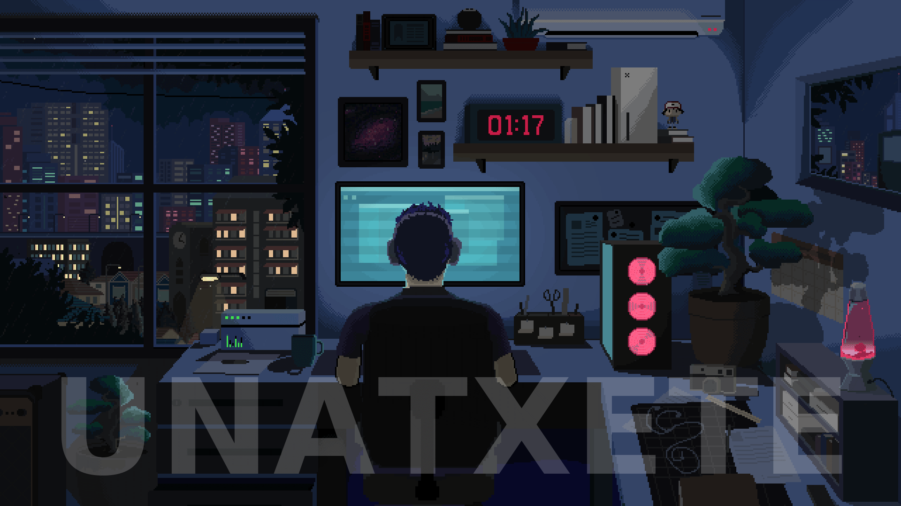
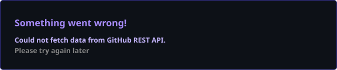

 

 

 

---

## About 👋

Hey, I'm a cybersecurity engineering student 🎓 who loves digging into network security, cryptography and data protection 🔐. I enjoy building clean, automated tools ⚙️ and turning manual work into repeatable systems.

🌱 Open to cybersecurity internships, security engineering roles and open source collaboration — always happy to chat!

---

## Knowledge

  

---

## GitHub Analytics

 

---

## Engineering Metrics

---

## Connect

---

*Security is not a feature you add at the end; it is a property you design from the first commit.*

