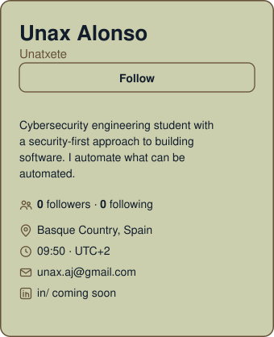

<div align="center">


<a href="https://github.com/Unatxete">
  
</a>

<br/>


<br/>

<a href="https://github.com/Unatxete?tab=repositories"></a>
<a href="https://www.linkedin.com/in/TU_USUARIO_LINKEDIN"></a>
<a href="mailto:TU_EMAIL@gmail.com"></a>
<a href="https://github.com/Unatxete"></a>

<br/>


</div>

<div align="center">

<a href="https://github.com/Unatxete">
  <picture>
    <source media="(prefers-color-scheme: dark)" srcset="./assets/dark_sidebar.svg" />
    
  </picture>
</a>

</div>

---

## About

Cybersecurity student and engineer-in-training with a security-first approach to building software. I work across network security, cryptography, databases and data protection (GDPR / RGPD), and I automate everything that can be automated: modular AI-assisted systems, MCP integrations and reproducible tooling.

- **Software engineering:** clean, modular Python with a strong bias toward automation, documentation and repeatable workflows.
- **Applied AI:** LLM-driven tooling built on Claude Code and the Model Context Protocol (MCP), from automation frameworks to personal knowledge systems.
- **Security engineering:** hands-on labs in VPNs, intrusion detection, web exploitation in controlled environments and database hardening.
- **Product mindset:** systems designed around real users and real constraints, with explicit rules, safe defaults and clear ownership of decisions.

<div align="center">

| Open To |
|:--|
| Cybersecurity internships and junior security roles |
| Security engineering, secure development and automation projects |
| Applied AI tooling, MCP integrations and open source collaboration |

</div>

---

## Tech Stack

### Languages


### Security & Networking


### Backend & Databases


### Cloud, DevOps & Tooling


---

## AI / ML Expertise

| Domain | Proficiency | Details |
|:--|:--|:--|
| AI-Assisted Automation | Hands-on | Modular systems on Claude Code with slash commands, persistent context and repeatable workflows |
| Model Context Protocol (MCP) | Hands-on | Integrations with several external services; a 67-tool server audited and debugged |
| LLM Tooling & Prompt Engineering | Applied | Structured prompts, knowledge modules and handoff protocols for agentic coding workflows |
| AI Governance & Privacy | Academic | Data Protection Impact Assessment of an LLM-driven recommender following AEPD methodology |

---

## Featured Projects

<div align="center">

<a href="https://github.com/Unatxete/AE2-BLOCKCHAIN">
  
</a>

</div>

<details>
<summary><b>AE2-BLOCKCHAIN &nbsp;|&nbsp; Cryptographic Blockchain in Python</b></summary>

<br/>

A blockchain implementation built around modern cryptographic primitives: digital signatures for transaction authenticity, hashing for chain integrity and authenticated encryption for protected payloads.

| | |
|:--|:--|
| **Stack** | Python, ECDSA, SHA-256, ChaCha20, AES-256-GCM |
| **Scale** | Complete chain lifecycle: key generation, signing, hashing, encryption and verification |
| **Performance** | Stream cipher (ChaCha20) and hardware-friendly AEAD (AES-256-GCM) options for payload protection |
| **Security** | Signature verification, tamper-evident hash linking and authenticated encryption |
| **Impact** | End-to-end applied cryptography project completed as part of the cybersecurity degree |
| **Repository** | [Unatxete/AE2-BLOCKCHAIN](https://github.com/Unatxete/AE2-BLOCKCHAIN) |

Designed to show how signatures, hashes and symmetric encryption combine into a system where every block can be independently verified.

</details>

<details>
<summary><b>Claude Code Automation Framework &nbsp;|&nbsp; Modular AI Workflows + MCP</b></summary>

<br/>

A modular automation framework where a `CLAUDE.md` file orchestrates knowledge modules, slash commands and live data from external services through MCP. It turns recurring manual routines into structured, repeatable workflows.

| | |
|:--|:--|
| **Stack** | Claude Code, MCP, REST APIs, Python (`uv`), Git |
| **Scale** | 67 MCP tools in a single server integration, several external services connected |
| **Performance** | End-to-end workflows generated and synchronised without manual steps |
| **Security** | Token-based authentication, credentials kept out of version control, documented fallback when a provider fails |
| **Impact** | 13 integration defects identified and resolved; runbooks and syntax references for repeatable operation |
| **Repository** | Available on request |

Built with explicit rules (mandatory review notes, deduplicated syncs, documented constraints) so the system behaves predictably over time.

</details>

<details>
<summary><b>Second Brain Study System &nbsp;|&nbsp; Claude Code + Obsidian</b></summary>

<br/>

A self-directed study system for cybersecurity fundamentals: a Claude Code repository wired into an Obsidian vault that checks notes against official syllabi, quizzes for retention and recommends what to study next.

| | |
|:--|:--|
| **Stack** | Claude Code, Obsidian, Markdown, Git, Syncthing, Smart Connections |
| **Scale** | 7 slash commands covering daily planning, guided study, completeness review, quizzes, resource search, previews and progress |
| **Performance** | Local semantic search and a cap on simultaneously active modules to keep study sessions focused |
| **Security** | No-overwrite and no-delete rule without confirmation; credentials excluded before the first commit |
| **Impact** | Structured path toward CCNA 200-301, Python, SQL and Git beyond the university curriculum |
| **Repository** | Local repository, in development |

Design principle: free resources first, syllabus-driven completeness checks and a system that never destroys the user's notes.

</details>

<details>
<summary><b>Network & Database Security Labs &nbsp;|&nbsp; EUNEIZ</b></summary>

<br/>

A series of hands-on labs in isolated environments covering both defensive and offensive techniques, each documented with findings and mitigations.

| | |
|:--|:--|
| **Stack** | WireGuard, Snort, sqlmap, MySQL, Linux |
| **Scale** | Five lab scenarios spanning network, application and database layers |
| **Performance** | Encrypted tunnel configuration and rule-based intrusion detection deployment |
| **Security** | SQL injection, ARP spoofing / MITM demonstration and MySQL privilege escalation through a `SQL SECURITY DEFINER` view, each paired with remediation |
| **Impact** | Practical understanding of how attacks work in order to design controls that stop them |
| **Repository** | University coursework |

</details>

<details>
<summary><b>DPIA on an LLM Recommender &nbsp;|&nbsp; Data Protection Impact Assessment</b></summary>

<br/>

A full Data Protection Impact Assessment (EIPD) of YouTube's LLM-driven recommendation system, written in Spanish and structured according to the methodology of the Spanish Data Protection Agency (AEPD).

| | |
|:--|:--|
| **Stack** | AEPD methodology, GDPR / RGPD, risk analysis |
| **Scale** | Complete assessment: processing description, necessity and proportionality, risk identification and mitigation |
| **Performance** | Structured, reproducible assessment framework |
| **Security** | Risk treatment for profiling, minors, transparency and data subject rights |
| **Impact** | Bridges legal compliance and technical controls for AI-driven systems |
| **Repository** | University coursework |

</details>

---

## Experience

### Cybersecurity Student
**EUNEIZ, Universidad de Vitoria-Gasteiz** &nbsp;|&nbsp; In progress, 3rd year

Degree focused on defending systems and data, combining technical depth with regulatory awareness.

- Network security: VPNs, intrusion detection, traffic analysis and attack demonstrations in labs
- Databases: privilege models, encryption, backups and hardening of MySQL
- Cryptography: symmetric and asymmetric primitives applied in working code
- Algorithms and data structures implemented in Python
- Data protection: GDPR / RGPD and AEPD methodology


### Independent AI Automation Engineer
**Personal Projects** &nbsp;|&nbsp; Ongoing

Design and maintenance of AI-assisted systems that replace manual routines with structured, auditable automation.

- Built and maintain a modular automation framework on Claude Code with MCP integrations
- Audited and debugged a 67-tool MCP server, resolving 13 defects
- Designing a syllabus-driven study system on Claude Code and Obsidian
- Documenting runbooks, syntax references and knowledge modules for repeatable operation


---

## Achievements

<div align="center">

| Recognition | Details |
|:--|:--|
| Applied Cryptography Project | Blockchain in Python combining ECDSA, SHA-256, ChaCha20 and AES-256-GCM |
| Data Protection Impact Assessment | Full EIPD of an LLM recommendation system following AEPD methodology |
| Network & Database Security Labs | WireGuard, Snort IDS, SQL injection, ARP spoofing and MySQL privilege escalation with mitigations |
| MCP Tooling Audit | 67-tool server integration reviewed, with 13 defects identified and fixed |

</div>

---

## Certifications

### Cisco


---

## Learning Roadmap

<div align="center">

| Domain | Focus |
|:--|:--|
| Networking | CCNA 200-301: routing, switching, IP services, network security fundamentals |
| Programming | Python fundamentals and data structures, Git and GitHub workflows |
| Databases | SQL in depth, privilege models, encryption and backup strategy |
| Security | Applied cryptography, secure programming, data protection engineering |

</div>

---

## GitHub Analytics

<div align="center">


<br/>


</div>

---

## Engineering Metrics

<div align="center">


</div>

---

## Contribution Activity

<div align="center">


</div>

---

## Contribution Snake

<div align="center">

<picture>
  <source media="(prefers-color-scheme: dark)" srcset="https://raw.githubusercontent.com/Unatxete/Unatxete/output/github-snake-dark.svg" />
  <source media="(prefers-color-scheme: light)" srcset="https://raw.githubusercontent.com/Unatxete/Unatxete/output/github-snake.svg" />
  
</picture>

</div>

---

## Current Focus

```yaml
Learning:
  - CCNA 200-301 and network fundamentals
  - Applied cryptography and secure programming
  - Data protection engineering (GDPR / RGPD)

Building:
  - Claude Code automation framework with MCP integrations
  - Second brain study system on Claude Code + Obsidian

Exploring:
  - Agentic workflows and MCP server tooling
  - Defensive security automation

Open To:
  - Cybersecurity internships and junior security roles
  - Open source collaboration
```

---

## Connect

<div align="center">

<a href="mailto:TU_EMAIL@gmail.com"></a>
<a href="https://www.linkedin.com/in/TU_USUARIO_LINKEDIN"></a>
<a href="https://github.com/Unatxete"></a>
<a href="https://github.com/Unatxete?tab=repositories"></a>

</div>

---

<div align="center">

*Security is not a feature you add at the end; it is a property you design from the first commit.*


</div>
