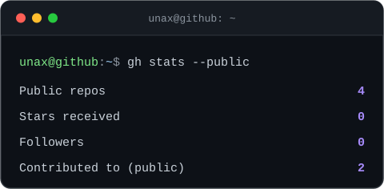

 
 

### Cybersecurity Engineering Undergraduate · Security-First Software

---

### 🌐 Connect with Me

<!-- TODO: add LinkedIn once you have it:

-->

---

### 🧑‍💻 whoami

Cybersecurity Engineering undergraduate at **EUNEIZ** (Basque Country, Spain), building a foundation
in secure software, networks and data. I use GitHub for coursework and self-directed IT study, and I
care about code that is documented, reproducible and safe by default.

---

### 🧰 Tech Stack

*Only technologies with evidence in my public repositories.*

**Languages &amp; Tools**

**Embedded · Databases · Learning**

---

### 📊 GitHub Analytics

 

---

### 🐍 Contribution Snake

<picture>
  <source media="(prefers-color-scheme: dark)" srcset="https://raw.githubusercontent.com/UnaxAlonso0/UnaxAlonso0/output/github-snake-dark.svg" />
  <source media="(prefers-color-scheme: light)" srcset="https://raw.githubusercontent.com/UnaxAlonso0/UnaxAlonso0/output/github-snake.svg" />
  
</picture>

---

### 🗂️ Projects

<!--
  Project template — copy this block for each new project. Public repos only.

  #### <name>
  > <one line: what it is and what it does>
  >
  > **Stack:** <tech> &nbsp;·&nbsp; **Status:** <Coursework · Public / In development> &nbsp;·&nbsp; **Repo:** [<name>](<url>)
-->

#### Trabajo-final
> Desktop music player built with JavaFX, packaged with a PowerShell script that fetches the JDK
> and JavaFX SDK and builds the app on Windows.
>
> **Stack:** Java · JavaFX · PowerShell &nbsp;·&nbsp; **Status:** Coursework · Public &nbsp;·&nbsp; **Repo:** [Trabajo-final](https://github.com/UnaxAlonso0/Trabajo-final)

#### Compluino
> MicroPython exercises for a microcontroller board: an alarm clock driven by a potentiometer,
> temperature and light sensors, buzzer melodies (PWM) and status LEDs.
>
> **Stack:** MicroPython · GPIO · PWM · ADC &nbsp;·&nbsp; **Status:** Coursework · Public &nbsp;·&nbsp; **Repo:** [Compluino](https://github.com/UnaxAlonso0/Compluino)

<!-- TODO: add personal IT/security projects here as they become public, using the template above. -->

---

### 📚 Learning

Areas I am studying as part of the degree and on my own — learning goals, not credentials.

| Domain | Focus |
|:--|:--|
| Networking | CCNA 200-301: routing, switching, IP services, security fundamentals |
| Security | Applied cryptography and secure development |
| Databases | SQL, privilege models, backups and hardening |
| Data protection | GDPR / RGPD and AEPD methodology |

---

### 📫 Contact

- **GitHub:** [@UnaxAlonso0](https://github.com/UnaxAlonso0)
- **Email:** [unax.aj@gmail.com](mailto:unax.aj@gmail.com)
- **LinkedIn:** <!-- TODO: add a LinkedIn profile URL here -->

<i>Security is not a feature you add at the end; it is a property you design from the first commit.</i>

